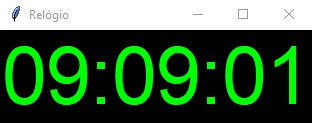

</br>

<p>PROJETO EM PYTHON</p>
<hr>
</br>
    <h3> Projeto realizado seguindo aulas!</h3>
    <p> Projeto simples de um relógio em Python </p>
    </br>
</br>
    

</br>
</br>

### 🎲 Rodando o Projeto

```bash

    # Clone este repositório  
    $ git clone <https://github.com/KayoSilva19/Projeto-Relogio-Python.git>

    # Acesse a pasta do projeto no terminal/cmd
    $ cd Proj_Relogio


```
